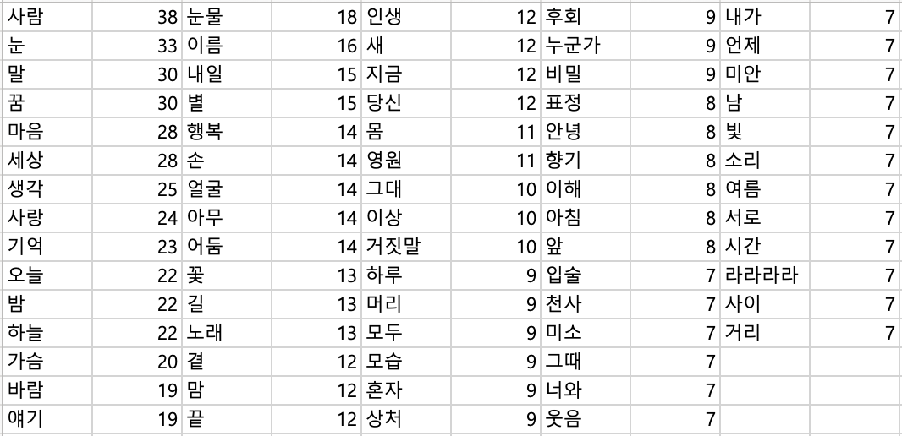

# Jaurim-nouns-on-lyrics-counting
밴드 자우림의 가사를 수집하고 KoNLPy를 이용하여 사용된 명사를 통계 내는 프로젝트

## 설명
Python의 requests와 BeautifulSoup를 이용하여 자우림의 가사를 수집하고, KoNLPy를 이용하여 사용된 명사를 통계 내는 프로젝트입니다.
※ 2024년 현재 크롤링 코드는 네이버 뮤직의 사이트 개편에 따라 더이상 작동하지 않습니다. (2019년에 작성된 코드)

## 통계치
